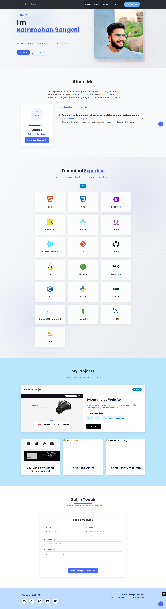

# 🌐 My Portfolio Website

Welcome to my personal portfolio website! This site showcases my projects, skills, and achievements in web development and electronics.

## 🚀 Features

- Responsive and clean UI
- Detailed project descriptions
- Resume download section
- Contact form for inquiries
- Skills and technologies list

## 🛠️ Tech Stack

- HTML5, CSS3, JavaScript
- React.js (or your frontend framework)
- Bootstrap/Tailwind (for styling)

## 📷 Preview

> *(Make sure to place your image in a folder named `images` or update the path accordingly.)*

## 📩 Contact

You can reach me via the contact form on the site or through the details provided in the resume section.

---

Feel free to fork, clone, or explore the code to see how everything is built!

